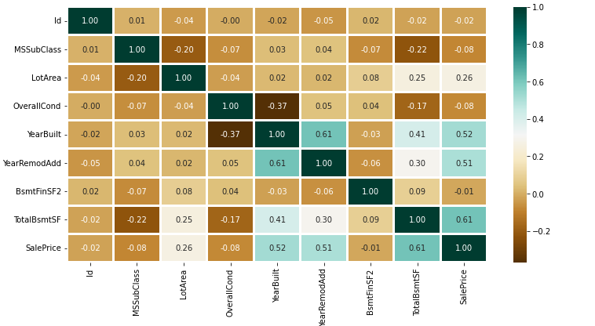
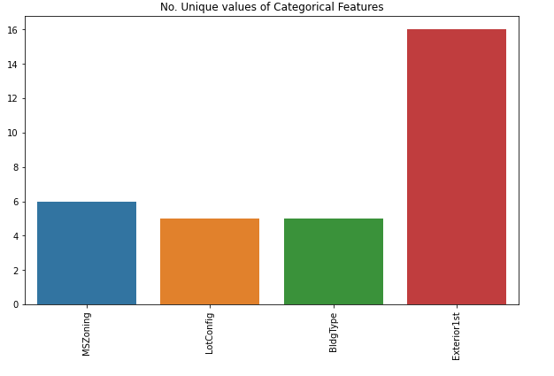
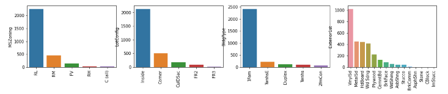

# House Price Prediction - Overview

This project focuses on predicting house prices using machine learning techniques. The dataset used contains information about various house features, such as the size, location, and age of the house, among others. Our goal is to build a predictive model that can estimate the sale price of a house based on these features.

The process involves several stages:

## 1. Importing Libraries and Dataset

In this step, we import the necessary libraries and load the dataset:

- **Pandas** – To load the DataFrame.
- **Matplotlib** – To visualize the data features (e.g., barplot).
- **Seaborn** – To see the correlation between features using a heatmap.

### Code:

```python
import pandas as pd
import matplotlib.pyplot as plt
import seaborn as sns

# Load the dataset
dataset = pd.read_excel("HousePricePrediction.xlsx")

# Printing first 5 records of the dataset
print(dataset.head(5))
```
## 2. Data Preprocessing

In this step, we categorize the features depending on their datatype (`int`, `float`, `object`) and then calculate the number of each type of feature.

### Code:

```python
# Identifying categorical features
obj = (dataset.dtypes == 'object')
object_cols = list(obj[obj].index)
print("Categorical variables:", len(object_cols))

# Identifying integer features
int_ = (dataset.dtypes == 'int')
num_cols = list(int_[int_].index)
print("Integer variables:", len(num_cols))

# Identifying float features
fl = (dataset.dtypes == 'float')
fl_cols = list(fl[fl].index)
print("Float variables:", len(fl_cols))
```
## 3. Exploratory Data Analysis

EDA refers to the deep analysis of data to discover different patterns and spot anomalies. Before making inferences from the data, it is essential to examine all your variables.

In this step, we use the Seaborn library to create a heatmap that shows the correlation between the numerical features.

### Code:

```python
# Select only numerical features for correlation analysis
numerical_dataset = dataset.select_dtypes(include=['number'])

# Plotting the correlation heatmap
plt.figure(figsize=(12, 6))
sns.heatmap(numerical_dataset.corr(),
            cmap = 'BrBG',
            fmt = '.2f',
            linewidths = 2,
            annot = True)
```
### Output:


### Analyzing Categorical Features

In this step, we analyze the different categorical features by plotting a barplot to visualize the number of unique values in each categorical feature.

### Code:

```python
# Analyzing categorical features
unique_values = []
for col in object_cols:
    unique_values.append(dataset[col].unique().size)

# Plotting the barplot for the number of unique values
plt.figure(figsize=(10, 6))
plt.title('No. Unique values of Categorical Features')
plt.xticks(rotation=90)
sns.barplot(x=object_cols, y=unique_values)

```
### Output :


### Categorical Features Distribution

The plot shows that the `Exterior1st` feature has around 16 unique categories, while other features have around 6 unique categories. To analyze the actual count of each category, we can plot a bar graph for each of the four categorical features separately.

#### Code:

```python
plt.figure(figsize=(18, 36))
plt.title('Categorical Features: Distribution')
plt.xticks(rotation=90)
index = 1

for col in object_cols:
    y = dataset[col].value_counts()
    plt.subplot(11, 4, index)
    plt.xticks(rotation=90)
    sns.barplot(x=list(y.index), y=y)
    index += 1
```
### Output :


### Data Cleaning

Data cleaning is the process of improving the dataset by removing incorrect, corrupted, or irrelevant data. In our dataset, some columns are not essential for model training. Therefore, we can drop these columns before proceeding with training.

#### Steps in Data Cleaning:

1. **Drop irrelevant columns**:
   The `Id` column does not participate in the prediction process, so we drop it from the dataset:

   ```python
   dataset.drop(['Id'], axis=1, inplace=True)
```
### Handling Missing Values

In our dataset, there are some missing values in the `SalePrice` column. To handle this, we replace the missing values with the mean of the existing `SalePrice` values. This helps in making the data distribution more symmetric.

#### Steps to handle missing values:

1. **Replace missing values in `SalePrice` with the mean**:
   The missing values in the `SalePrice` column are filled with the mean of the existing values:

   ```python
   dataset['SalePrice'] = dataset['SalePrice'].fillna(
     dataset['SalePrice'].mean())
```
### Dropping Records with Null Values

In our dataset, the number of records with null values is very small. Since they will not significantly impact the overall dataset, we can safely drop these records.

#### Steps to drop rows with null values:

1. **Remove rows with null values**:
   We drop rows that contain any missing values using the `dropna()` method:

   ```python
   new_dataset = dataset.dropna()
```
### Checking Features with Null Values in the New Dataset

After dropping rows with null values, it's important to confirm that no features still contain missing data.

#### Steps to check for null values:

1. **Check for null values in the new dataset**:
   We can check each feature in the `new_dataset` to ensure that there are no missing values left by using the `isnull().sum()` method:

   ```python
   new_dataset.isnull().sum()
```
### OneHotEncoder – For Label Categorical Features

OneHotEncoding is an effective method for converting categorical data into binary vectors, which can then be used in machine learning models. It transforms the categorical labels into a format that can be easily interpreted by algorithms.

#### Steps for One-Hot Encoding:

1. **Identify categorical columns**:
   First, we identify the columns that contain categorical data (object data type) in the `new_dataset`. We do this by checking the `dtypes` of the dataset and selecting the features with the object type.

   ```python
   from sklearn.preprocessing import OneHotEncoder

   s = (new_dataset.dtypes == 'object')
   object_cols = list(s[s].index)
   print("Categorical variables:")
   print(object_cols)
   print('No. of categorical features: ', len(object_cols))

```
### Applying OneHotEncoding to Categorical Features

After identifying the categorical features, we can apply OneHotEncoding to convert the categorical columns into a binary format (0s and 1s). This allows machine learning algorithms to work with the data in a structured, numerical format.

#### Steps for One-Hot Encoding:

1. **Initialize the OneHotEncoder**:
   We initialize the `OneHotEncoder` from `sklearn.preprocessing`, specifying the following parameters:
   - `sparse=False`: This ensures the encoded values are returned as a dense array rather than a sparse matrix.
   - `handle_unknown='ignore'`: This handles any unseen categories during transformation without raising errors.

   ```python
   OH_encoder = OneHotEncoder(sparse=False, handle_unknown='ignore')

```
### Splitting the Dataset into Training and Testing Sets

In machine learning, splitting the dataset into training and testing sets is crucial for evaluating the model’s performance. In this step, we separate the target variable (`SalePrice`) from the features and then divide the data into training and validation sets.

#### Steps:

1. **Extract Features (X) and Target (Y)**:
   We separate the target variable `SalePrice` from the rest of the features. The target variable is assigned to `Y`, and the remaining columns are assigned to `X`.

   ```python
   X = df_final.drop(['SalePrice'], axis=1)  # Drop SalePrice to get feature columns
   Y = df_final['SalePrice']  # Extract SalePrice as the target variable
### Model and Accuracy

In this project, we are working on predicting continuous values, so we will use regression models to train the dataset and evaluate their performance. Below are the models we will be using:

#### 1. **SVM - Support Vector Machine**:
   Support Vector Machines (SVM) are a class of supervised learning models that can be used for both classification and regression tasks. For regression, SVM finds a hyperplane in a multi-dimensional space that best fits the data.

   **Code Example**:
   ```python
   from sklearn import svm
   from sklearn.svm import SVC
   from sklearn.metrics import mean_absolute_percentage_error

   model_SVR = svm.SVR()  # Support Vector Regressor
   model_SVR.fit(X_train, Y_train)  # Train the model
   Y_pred = model_SVR.predict(X_valid)  # Predict on the validation set

   print(mean_absolute_percentage_error(Y_valid, Y_pred))  # Calculate the error
```
### SVM – Support Vector Machine

SVM (Support Vector Machine) can be used for both regression and classification tasks. In the case of regression, SVM finds the hyperplane in an n-dimensional space that best fits the data. SVM aims to minimize the error margin while finding this hyperplane.

#### Code Example:

```python
from sklearn import svm
from sklearn.metrics import mean_absolute_percentage_error

# Create the Support Vector Regressor (SVR) model
model_SVR = svm.SVR()
# Train the model on the training data
model_SVR.fit(X_train, Y_train)
# Predict on the validation data
Y_pred = model_SVR.predict(X_valid)

# Calculate and print the Mean Absolute Percentage Error (MAPE)
print(mean_absolute_percentage_error(Y_valid, Y_pred))
```
### Random Forest Regression

Random Forest is an ensemble learning method that utilizes multiple decision trees. It can be applied to both regression and classification tasks. Random Forest works by constructing several decision trees during training and outputting the mean prediction (in regression) or the majority vote (in classification) of the individual trees. This technique helps reduce overfitting and improves the model's stability and accuracy.

#### Code Example:

```python
from sklearn.ensemble import RandomForestRegressor
from sklearn.metrics import mean_absolute_percentage_error

# Create the Random Forest Regressor model with 10 estimators (trees)
model_RFR = RandomForestRegressor(n_estimators=10)
# Train the model on the training data
model_RFR.fit(X_train, Y_train)
# Predict on the validation data
Y_pred = model_RFR.predict(X_valid)

# Calculate and print the Mean Absolute Percentage Error (MAPE)
print(mean_absolute_percentage_error(Y_valid, Y_pred))
```
### Linear Regression

Linear Regression is a statistical method used to predict the value of a dependent variable (target) based on one or more independent variables (features). In this case, we aim to predict the **SalePrice** based on various features like **MSSubClass**, **YearBuilt**, **BldgType**, and **Exterior1st**. Linear Regression tries to find the best-fitting line (hyperplane) that minimizes the error between predicted and actual values.

#### Code Example:

```python
from sklearn.linear_model import LinearRegression
from sklearn.metrics import mean_absolute_percentage_error

# Create the Linear Regression model
model_LR = LinearRegression()
# Train the model on the training data
model_LR.fit(X_train, Y_train)
# Predict on the validation data
Y_pred = model_LR.predict(X_valid)

# Calculate and print the Mean Absolute Percentage Error (MAPE)
print(mean_absolute_percentage_error(Y_valid, Y_pred))
```
### Conclusion

In this project, we performed various stages of data preprocessing and modeling to predict house prices using different regression models. 

1. **Data Preprocessing**: We handled missing values, performed feature encoding using OneHotEncoder, and prepared the data for model training by splitting it into training and validation sets.

2. **Modeling**: We applied multiple regression models to predict the **SalePrice**:
   - **Support Vector Regression (SVR)**: Achieved a Mean Absolute Percentage Error (MAPE) of 0.18705129.
   - **Random Forest Regression**: Provided a MAPE of 0.1929469.
   - **Linear Regression**: Gave a MAPE of 0.187416838.

3. **Model Evaluation**: The models were evaluated using the **Mean Absolute Percentage Error (MAPE)**, which measures the accuracy of the predictions. 

### Key Insights:
- All models performed well with relatively low MAPE values, indicating that they could make accurate predictions of house prices.
- **SVR** and **Linear Regression** models achieved the best results, with **Linear Regression** slightly trailing **SVR**.
- **Random Forest**, while still performing well, showed slightly higher error values, which may indicate that more trees or fine-tuning of hyperparameters could improve performance.

In conclusion, the **SVR** and **Linear Regression** models are well-suited for predicting house prices, though further improvements in the models could lead to better performance.


